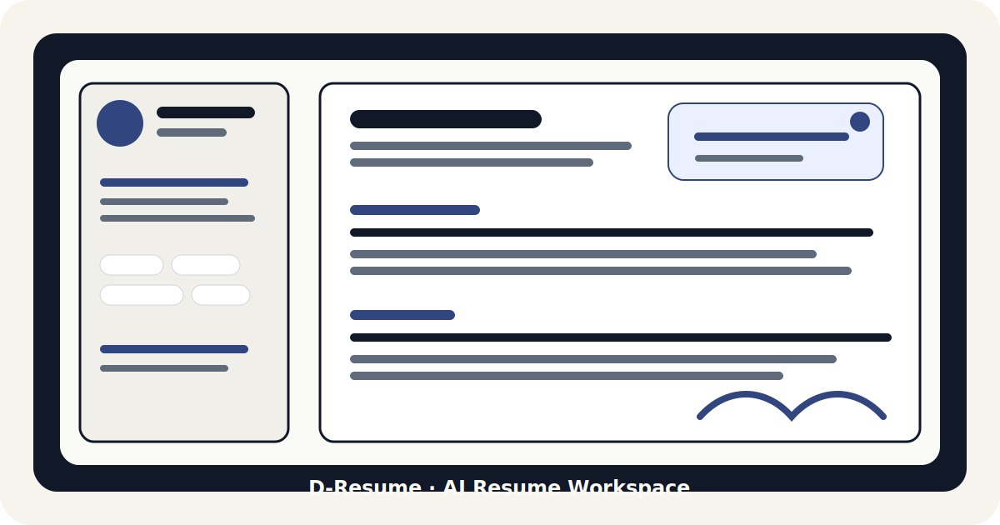

<p align="center">
  <h1 align="center">Resume Studio</h1>
  <p align="center">
    <strong>Build, tailor, review, and rehearse your resume with an AI-native workspace.</strong>
  </p>
  <p align="center">
    Conversational Editing • Visual Layouts • JD-Aware Optimization • Mock Interviews
  </p>
</p>

<p align="center">
  <a href="#quick-start"></a>
  <a href="#tech-stack"></a>
  <a href="#tech-stack"></a>
  <a href="#tech-stack"></a>
  <a href="#tests"></a>
</p>

<p align="center">
  <a href="#why-resume-studio"><strong>Why</strong></a>
  •
  <a href="#preview"><strong>Preview</strong></a>
  •
  <a href="#product-tour"><strong>Product Tour</strong></a>
  •
  <a href="#quick-start"><strong>Quick Start</strong></a>
  •
  <a href="#architecture"><strong>Architecture</strong></a>
  •
  <a href="./README.zh-CN.md"><strong>中文</strong></a>
</p>

---

<p align="center">
  
</p>

## Why Resume Studio?

Resume Studio is a full-stack AI workspace for the messy, iterative reality of job applications. Instead of treating resume writing as a one-shot document generation task, it gives users a place to refine content, tune layout, align with a target job description, and practice the interview that follows.

Most resume tools stop at templates. Resume Studio focuses on the whole loop:

<table>
  <tr>
    <td width="25%" align="center"><b>Import</b><br>Bring in resume data and job context.</td>
    <td width="25%" align="center"><b>Improve</b><br>Use an agent to rewrite, clarify, and restructure.</td>
    <td width="25%" align="center"><b>Design</b><br>Tune the layout with visual controls and reusable templates.</td>
    <td width="25%" align="center"><b>Rehearse</b><br>Run mock interviews grounded in the resume and target JD.</td>
  </tr>
</table>

It is designed as a practical product prototype and as an agent engineering playground: the backend exposes observable tool calls, regression evaluations, self-checking, and deterministic test coverage so changes can be measured instead of guessed.

## Preview

### Built for the full application loop
Resume Studio is designed around the real path from a rough resume to a targeted application: import, refine, align with a job description, tune the document, and rehearse the interview.

> _Drop your upcoming screenshots into `docs/assets/` and replace this preview panel with real product captures._

### Interviewer Presets

<p align="center">
  
  
</p>

## Product Tour

### Chat-Driven Resume Editing
Ask for targeted edits like "make my summary more backend-focused" or "rewrite the first bullet with stronger metrics." The agent reads the current resume, chooses tools, applies field-level edits, and streams its progress to the UI.
* Function-calling agent loop
* Resume-aware context assembly
* Field-level updates with structured paths
* Confirmation flow for sensitive factual changes

### Visual Layout Builder
Design the resume as a real document, not just a blob of text. Adjust sections, template guidance, spacing, typography, two-column layouts, tags, headers, and printable HTML output.
* Single-column and two-column resume layouts
* Section order and visibility controls
* Template-level guidance and local presets
* HTML export path for reliable browser printing

### JD-Aware Resume Targeting
Attach a target job description and let the assistant reason against it. The system can inject JD context into the agent loop and use retrieval-oriented guidance to identify alignment opportunities.
* Target JD context injection
* RAG-ready local artifacts
* Role-specific rewrite guidance
* Clear separation between resume data and layout templates

### Mock Interview Workspace
Practice with interviewers from different domains. The flow supports interviewer recommendations, resume/JD-grounded questions, interview termination detection, and a dedicated review mode after the session ends.
* Multi-industry interviewer presets
* Resume-aware and JD-aware prompts
* Custom user preference prompt
* Post-interview review mode

## Highlights

| Area | What makes it useful |
| --- | --- |
| **Agent UX** | Tool calls are streamed over SSE, so the UI can show what the assistant is doing instead of waiting on a silent black box. |
| **Resume Edits** | Edits are applied to structured resume fields, which keeps content changes inspectable and easier to test. |
| **Layout Design**| Template state is separated from resume content, so changing a layout does not silently mutate the resume itself. |
| **Export** | Printable HTML is the default export path. TeX is generated as source for users who want to compile in Overleaf or a local XeLaTeX environment. |
| **Evaluation** | Agent behavior has regression scenarios, fixture-based tests, and reporting scripts for iterative improvement. |
| **Local-first** | The project is designed to run locally with explicit `.env` configuration and local runtime artifacts. |

## Quick Start

### Environment Setup

Detailed install guides for Python and Node.js on all platforms: [Development Setup → Environment Setup](./docs/development/setup.md#environment-setup--%E7%8E%AF%E5%A2%83%E5%AE%89%E8%A3%85)

**TL;DR:**

| Platform | Python | Node.js |
|----------|--------|---------|
| macOS | `brew install python@3.13` | `brew install node@22` |
| Windows | [python.org](https://www.python.org/downloads/) (check "Add to PATH") | [nodejs.org](https://nodejs.org/) (LTS) |
| Ubuntu | `sudo apt install python3 python3-pip python3-venv` | `curl -fsSL https://deb.nodesource.com/setup_22.x \| sudo -E bash - && sudo apt install -y nodejs` |

Minimal versions: **Python ≥ 3.11**, **Node.js ≥ 18**. Verify with `python --version` and `node --version`.

### Install

```bash
git clone https://github.com/MengPaul07/resume-studio
cd resume-studio

# Backend
python -m venv .venv
source .venv/bin/activate   # Windows: .venv\Scripts\activate
pip install -r requirements.txt

# Frontend
cd frontend
npm install
cd ..

# Config
cp .env.example .env        # Windows: copy .env.example .env
# Edit .env and add your LLM_API_KEY
```

### Run Everything

```bash
npm run dev
```

| Service | URL |
| --- | --- |
| Frontend | `http://127.0.0.1:5173` |
| Backend API | `http://127.0.0.1:8000` |
| API Docs | `http://127.0.0.1:8000/docs` |

### Run Services Separately

```bash
npm run dev:backend
npm run dev:frontend
```

## Agent System

Resume Studio uses a function-calling agent loop rather than a single prompt that returns prose. This makes editing behavior observable and testable.

| Component | Role |
| --- | --- |
| Intent resolver | Classifies the user request into editing, analysis, fact change, or general chat categories. |
| Chain planner | Maps intent to a deterministic tool chain such as observe, suggest, refine, and compose. |
| Tool runner | Executes read, edit, confirm, and compose tools while streaming SSE events. |
| Self-checker | Reviews the output and can request a retry or fail softly when the response is not good enough. |
| Eval scripts | Run regression scenarios and produce reports for agent behavior changes. |

### Key Files

| Path | Role |
| --- | --- |
| `src/services/content_refinement_v3/agent/turn_runner.py` | Turn orchestration, tool execution, and SSE output |
| `src/services/content_refinement_v3/agent/_planner.py` | Intent classification and deterministic chain mapping |
| `src/services/content_refinement_v3/agent/_self_check.py` | Response quality checks and retry decisions |
| `src/services/content_refinement_v3/prompts/agent.py` | Agent and self-check prompts |
| `src/services/layout_design/` | Resume layout rendering, pagination, and HTML/TeX generation |
| `frontend/src/` | React app, chat UI, layout builder, and mock interview UI |

## Layout Builder

The layout system is built around reusable guidance and section configuration rather than hard-coded one-off templates.

| Capability | Description |
| --- | --- |
| Section control | Reorder and hide resume sections without changing the underlying resume content. |
| Template guidance | Store layout and style preferences as template-level state. |
| HTML rendering | Generate A4-style printable HTML for browser-native export. |
| TeX source | Generate TeX for users who prefer Overleaf or local XeLaTeX compilation. |
| Style tuning | Adjust variables such as page padding, column width, spacing, heading style, tag style, and font sizing. |

## Mock Interview

The mock interview flow is built for targeted practice rather than generic question lists.

<p align="center">
  
</p>

| Stage | What happens |
| --- | --- |
| **Setup** | The user selects interview length, interviewer style, industry tags, target JD, resume, and optional custom preferences. |
| **Interview** | The interviewer starts with the first message, asks resume/JD-grounded questions, and adapts across rounds. |
| **Termination** | The system can detect when an interview has ended instead of forcing a fixed flow. |
| **Review** | A dedicated review prompt can analyze the session and give focused feedback. |

## Tech Stack

| Layer | Technologies |
| --- | --- |
| **Backend** | FastAPI, Pydantic, LiteLLM, SSE, SQLite-backed local stores |
| **Frontend** | React 18, Vite, TypeScript, Tailwind CSS, Framer Motion, i18next |
| **Retrieval** | FAISS, fastembed, local JD/context artifacts |
| **Documents** | HTML export, TeX source export, Jinja2, MarkItDown |
| **Quality** | pytest, frontend build checks, agent eval scripts |

## Project Structure

```text
resume-studio/
  ├── src/                         # FastAPI backend (API routes & services)
  │   ├── api/                     # Controller endpoints
  │   ├── services/
  │   │   ├── content_refinement_v3/ # Agent loop, prompts, resume editing
  │   │   └── layout_design/         # HTML/TeX layout rendering
  ├── frontend/                    # React + Vite frontend
  │   └── src/                     # UI components, pages, hooks, forms
  ├── config/                      # Document types & runtime config
  ├── scripts/                     # Evaluation & maintenance scripts
  ├── tests/                       # Backend test suite
  └── docs/                        # Architecture notes & documentation
```

## Tests

Run the backend test suite:

```bash
python -m pytest tests -q
```
*(Expects ~131 passing tests out-of-the-box)*

Run the frontend build check:

```bash
npm --prefix frontend run build
```

See [tests/README.md](./tests/README.md) for a more detailed testing guide.

## Agent Evaluation

For agent behavior work, start the backend first:

```bash
python -m uvicorn src.main:app --host 127.0.0.1 --port 8000
```

Then run one of the evaluation commands:

```bash
python scripts/agent_eval.py --regression --base-url http://127.0.0.1:8000/api/v1 -j 4
python scripts/agent_eval.py --base-url http://127.0.0.1:8000/api/v1 -j 4
python scripts/dres_bench.py iterate diagnose
```

## Document Types & Templates

- Copy `.env.example` to `.env` before running the app.
- The project is local-first by default; generated runtime artifacts stay out of the source tree.
- TeX export is generated as pure source text for user compilation.
- Layout templates and resume data are strictly separated to prevent accidental content loss during design changes.

## Documentation

All documentation lives in [`docs/`](./docs/). Start from the [Index](./docs/index.md) or jump directly to any topic:

- **Features**: [Dashboard](./docs/features/dashboard.md) • [Resume Builder](./docs/features/resume-studio.md) • [AI Tailor](./docs/features/ai-tailor.md) • [Mock Interview](./docs/features/mock-interview.md) • [Settings](./docs/features/settings.md)
- **Development**: [Setup Guide](./docs/development/setup.md) • [Architecture](./docs/development/architecture.md)
- **Design & Notes**: [Layout Flow](./docs/layout_design_main_flow.md) • [UI Style Guide](./docs/ui-style-guide-v2.md) • [Plans](./docs/plans/)

## Credits

The frontend and resume template direction were originally inspired by [Resume-Matcher](https://github.com/srbhr/Resume-Matcher).
