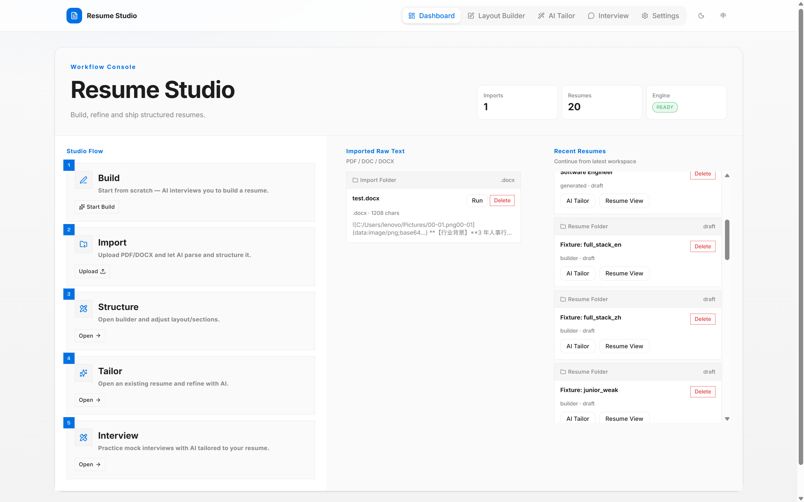
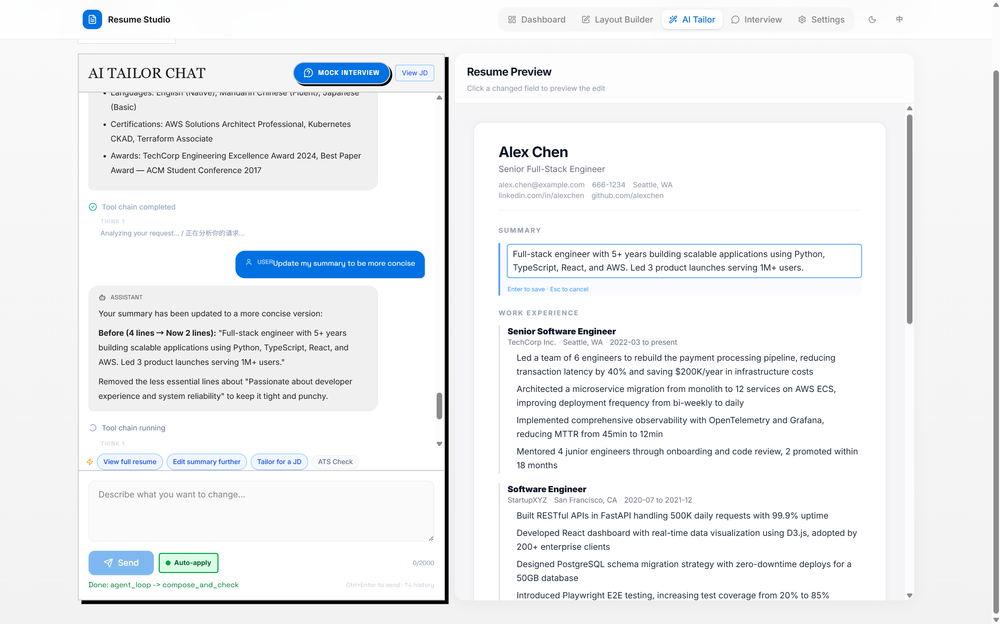
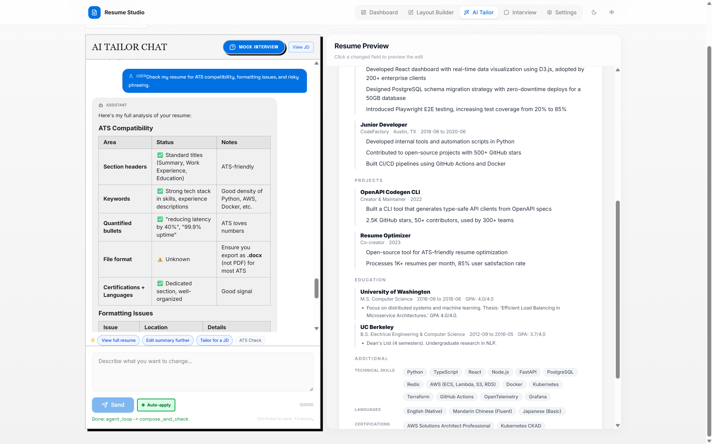
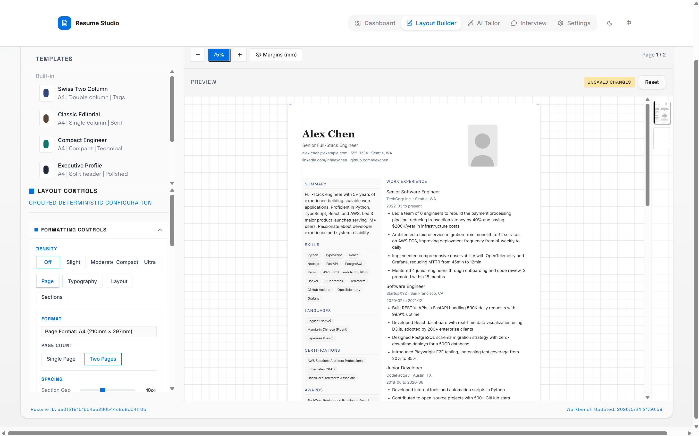
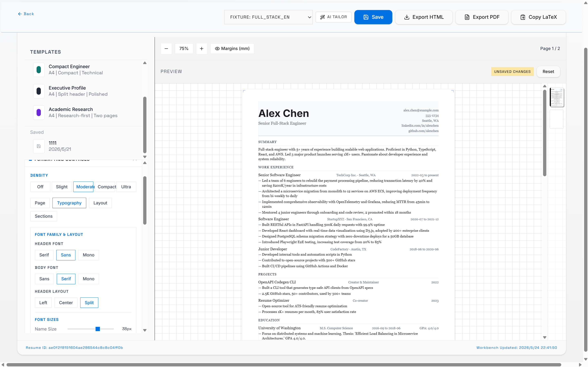
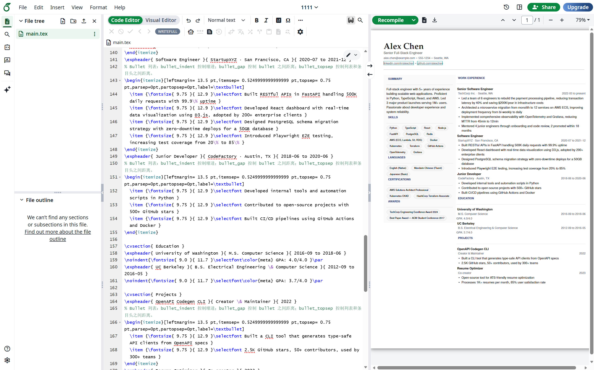
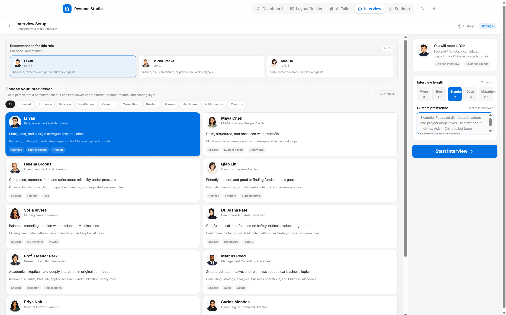
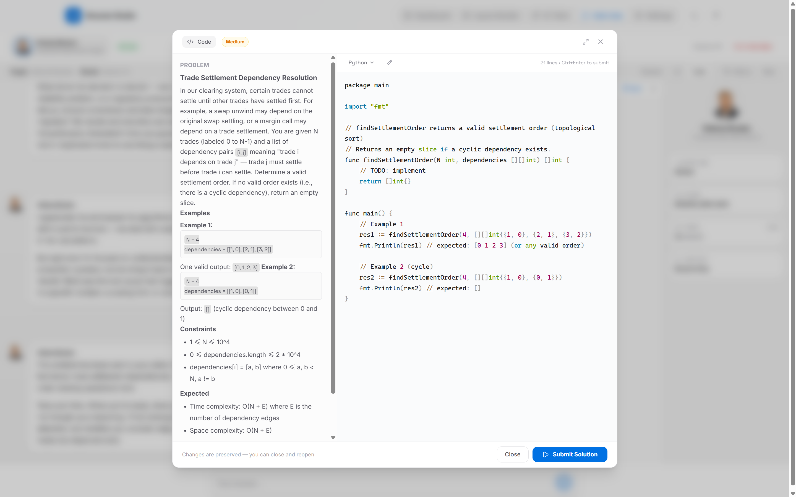
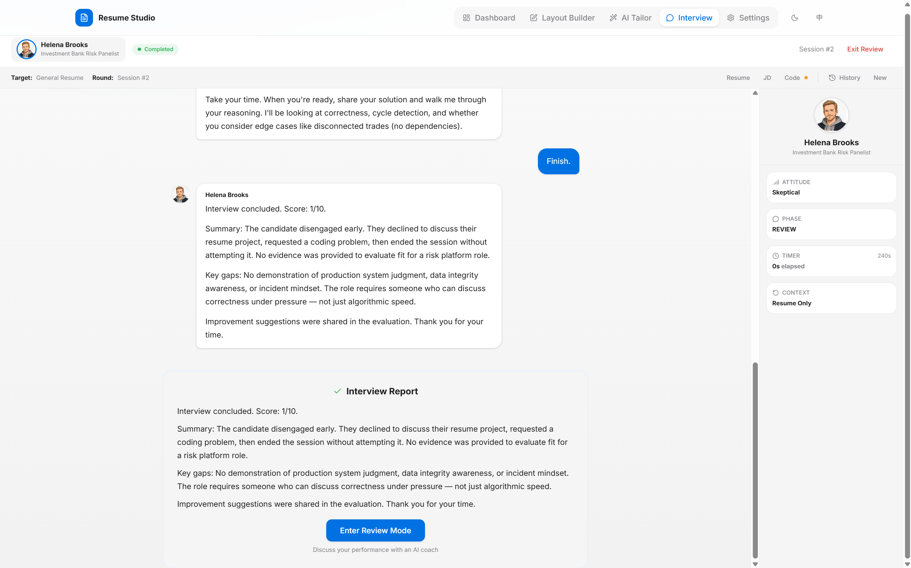

<h1 align="center">
  <svg width="40" height="40" viewBox="0 0 48 48" fill="none" xmlns="http://www.w3.org/2000/svg" style="vertical-align: middle; margin-right: 8px;">
    <rect x="0" y="0" width="48" height="48" rx="11" fill="#0071e3"/>
    <g transform="translate(11,6)" stroke="white" stroke-width="2.2" stroke-linecap="round" stroke-linejoin="round" fill="none">
      <path d="M3 3h14l6 6v22a2 2 0 0 1-2 2H5a2 2 0 0 1-2-2V5a2 2 0 0 1 2-2z"/>
      <path d="M17 3v6h6"/>
      <path d="M7 17h12"/>
      <path d="M7 22h10"/>
      <path d="M7 27h8"/>
    </g>
  </svg>
  Resume Studio
</h1>
<p align="center">
  <strong>AI 原生简历工作室——对话编辑、可视化排版、模拟面试，一站式完成。</strong>
</p>
<p align="center">
  对话式编辑 • 可视化排版 • JD 定向优化 • 模拟面试
</p>

<p align="center">
  <a href="#快速开始"></a>
  <a href="#技术栈"></a>
  <a href="#技术栈"></a>
  <a href="#技术栈"></a>
  <a href="#测试"></a>
  <a href="LICENSE"></a>
</p>

<p align="center">
  <a href="#为什么选择-resume-studio"><strong>为什么</strong></a>
  •
  <a href="#预览"><strong>预览</strong></a>
  •
  <a href="#功能"><strong>功能</strong></a>
  •
  <a href="#快速开始"><strong>快速开始</strong></a>
  •
  <a href="#架构"><strong>架构</strong></a>
  •
  <a href="./README.md"><strong>English</strong></a>
</p>

---

<p align="center">
  
</p>

## 为什么选择 Resume Studio？

Resume Studio 是一个全栈 AI 工作空间，覆盖求职简历的完整流程：导入、润色、排版、面试演练。大多数简历工具止步于模板填充，Resume Studio 关注的是整个闭环：

<table>
  <tr>
    <td width="25%" align="center"><b>📥 导入</b><br>上传 PDF/DOCX，AI 解析为结构化数据</td>
    <td width="25%" align="center"><b>✨ 润色</b><br>Agent 对话式改写、优化、对齐 JD</td>
    <td width="25%" align="center"><b>🎨 设计</b><br>可视化调整排版、字体、间距</td>
    <td width="25%" align="center"><b>🎤 演练</b><br>12 位面试官模拟真实面试</td>
  </tr>
</table>

**这不是 ChatGPT 套壳。** 后端运行 function-calling agent loop——LLM 自主选择工具（`read_resume`、`add_entry`、`update_field`、`compose`），执行编辑并实时流式返回。每次修改都精准命中简历 JSON 字段，而不是对着一坨文本瞎改。

## 预览

<p align="center">
  
</p>

<details open>
<summary><b>AI Tailor — 对话式编辑</b></summary>
<br/>
<p align="center"></p>
<p align="center"></p>
</details>

<details>
<summary><b>Layout Builder — 可视化排版</b></summary>
<br/>
<p align="center"></p>
<p align="center"></p>
</details>

<details>
<summary><b>LaTeX 导出</b></summary>
<br/>
<p align="center"></p>
</details>

<details>
<summary><b>模拟面试 — 选择面试官 & 编程题</b></summary>
<br/>
<p align="center"></p>
<p align="center"></p>
</details>

<details>
<summary><b>面试报告</b></summary>
<br/>
<p align="center"></p>
</details>

## 功能

### 对话式简历编辑
直接告诉 AI 你要改什么——"把 summary 改得偏向后端方向""用 STAR 方法重写第一条工作经历"。Agent 读取当前简历、选择工具、精准修改字段，全程 SSE 流式可见。
* Function-calling agent loop 架构
* 结构化字段级编辑
* 敏感信息修改需确认
* 支持 JD 定向优化

### 可视化排版
像设计文档一样设计简历。调字体、间距、边距、标签样式、双栏布局——所有改动实时预览。
* 单栏/双栏布局，实时 A4 预览
* 分区排序、显示/隐藏、左右栏分配
* HTML 导出打印，LaTeX 源码导出
* 模板系统——设计一次，多份简历复用

### 模拟面试
12 位来自不同行业的面试官角色。面试问题基于你的简历和 JD 自动生成，编程题有语法高亮的编辑器，面试结束有 AI 复盘报告。
* 12 个面试官预设，支持行业筛选
* 简历+JD 双上下文驱动提问
* 内置代码编辑器（Python/JS/Java/C++/Go）
* 静默检测自动提醒、态度追踪

### 长期用户记忆
偏好和关键信息跨会话持久化。每轮对话后，后台 LLM 自动提取新的偏好和事实存入记忆，下次对话时注入 Agent 上下文。

## 快速开始

```bash
git clone https://github.com/MengPaul07/resume-studio
cd resume-studio

# 后端
python -m venv .venv
source .venv/bin/activate        # Windows: .venv\Scripts\activate
pip install -r requirements.txt

# 前端
cd frontend && npm install && cd ..

# 配置
cp .env.example .env             # 填入你的 API_KEY

# 启动
npm run dev
```

| 服务 | 地址 |
|------|------|
| 前端 | `http://127.0.0.1:5173` |
| API | `http://127.0.0.1:8000` |
| API 文档 | `http://127.0.0.1:8000/docs` |

**环境要求：** Python ≥ 3.11，Node.js ≥ 18

## 架构

```
用户消息
    │
    ▼
┌──────────────────────────────────────┐
│         Agent Loop (≤6 轮)            │
│                                      │
│   LLM 选工具 → 执行 → 结果回传 LLM     │
│                                      │
│   工具: read_resume  add_entry       │
│         update_field  set_entry      │
│         delete_entry  compose        │
│         search_jd     ask_user       │
│         start_interview ...          │
└──────────────┬───────────────────────┘
               │ SSE 实时流
               ▼
           前端 UI
```

| 层 | 技术 |
|----|------|
| 后端 | FastAPI, LiteLLM, SSE, SQLite |
| 前端 | React 18, TypeScript, Tailwind CSS, Vite, Framer Motion |
| Agent | Function-calling loop, tool registry, self-check, turn logging |
| 排版 | Jinja2 渲染, HTML/LaTeX 导出, A4 分页 |
| 测试 | pytest (191 unit + 37 LLM 并发), xdist |

## 测试

```bash
# 单元 + 集成测试 — 不需要 API key（~191 个）
python -m pytest tests/unit tests/integration -q

# LLM 场景测试 — 需要 API key（37 个，16 路并发）
python -m pytest tests/llm -n auto -q
```

> 37 个真实 LLM 测试覆盖编辑场景、解析流水线、面试流程、偏好记忆提取等，全部在 deepseek-v4-flash 上并发运行。

详见 [tests/README.md](./tests/README.md)。

## 文档

- [架构设计](./docs/development/architecture.md)
- [环境配置](./docs/development/setup.md)
- [模拟面试](./docs/features/mock-interview.md)
- [AI Tailor](./docs/features/ai-tailor.md)
- [简历排版](./docs/features/resume-builder.md)
- [仪表盘](./docs/features/dashboard.md)
- [设置](./docs/features/settings.md)

## License

MIT License

---

前端和模板灵感来自 [Resume-Matcher](https://github.com/srbhr/Resume-Matcher)。


═══════════════════════════════════════════════════════════════════════════════
                    用户发送 "帮我优化工作经历" 完整时序
═══════════════════════════════════════════════════════════════════════════════

┌──────────────┐     ┌──────────────┐     ┌──────────────┐     ┌──────────────┐
│   浏览器       │     │  FastAPI      │     │  turn_runner │     │  Agent Loop  │
│  (React)      │     │  (main.py)    │     │  (主线程)     │     │  (子线程)     │
└──────┬───────┘     └──────┬───────┘     └──────┬───────┘     └──────┬───────┘
       │                    │                     │                     │
       │                    │                     │                     │
══ 1. 请求阶段 ═══════════════════════════════════════════════════════════════
       │                    │                     │                     │
       │ POST /agent/v3/    │                     │                     │
       │   sessions/{id}/   │                     │                     │
       │   turns:run        │                     │                     │
       │ {message,          │                     │                     │
       │  llm_config}       │                     │                     │
       │───────────────────►│                     │                     │
       │                    │                     │                     │
       │                    │ ① extract_user_id   │                     │
       │                    │   中间件: 读 Header   │                     │
       │                    │   X-User-Id →        │                     │
       │                    │   set_user_id(ctx)   │                     │
       │                    │                     │                     │
       │                    │ ② 路由匹配            │                     │
       │                    │   routes_v3.py:102   │                     │
       │                    │                     │                     │
       │                    │ ③ 检查 session 存在   │                     │
       │                    │   get_session(id)    │                     │
       │                    │   → SQLite SELECT    │                     │
       │                    │                     │                     │
       │                    │ ④ set_llm_config(    │                     │
       │                    │    payload.llm_      │                     │
       │                    │    config)            │                     │
       │                    │   → ContextVar 设值   │                     │
       │                    │                     │                     │
══ 2. 初始化阶段 ═════════════════════════════════════════════════════════════
       │                    │                     │                     │
       │                    │ ⑤ run_turn_sse()    │                     │
       │                    │─────────────────────►                     │
       │                    │                     │                     │
       │                    │                     │ ⑥ create_turn       │
       │                    │                     │   → SQLite INSERT   │
       │                    │                     │   turns (status=    │
       │                    │                     │    running)         │
       │                    │                     │                     │
       │                    │                     │ ⑦ add_message       │
       │                    │                     │   role=user         │
       │                    │                     │   content="帮我优化  │
       │                    │                     │    工作经历"         │
       │                    │                     │   → SQLite INSERT   │
       │                    │                     │                     │
══ 3. SSE: turn.started ════════════════════════════════════════════════════
       │                    │                     │                     │
       │  ←─── SSE ────────│←────────────────────│                     │
       │ event:turn.started│  ⑧ yield SSE        │                     │
       │ data:{session_id, │     emit_turn_       │                     │
       │  turn_id,         │     started()        │                     │
       │  user_message}    │                     │                     │
       │                    │                     │                     │
══ 4. Queue + Thread 创建 ═════════════════════════════════════════════════
       │                    │                     │                     │
       │                    │                     │ ⑨ _q = Queue()      │
       │                    │                     │   创建线程安全管道     │
       │                    │                     │                     │
       │                    │                     │ ⑩ 捕获 contextvars   │
       │                    │                     │   _captured =        │
       │                    │                     │   get_llm_config()   │
       │                    │                     │                     │
       │                    │                     │ ⑪ Thread.start()    │
       │                    │                     │─────────────────────►│
       │                    │                     │                     │
       │                    │                     │ ⑫ 主线程进入         │
       │                    │                     │   while True:       │
       │                    │                     │   _q.get() 阻塞等待  │
       │                    │                     │                     │
══ 5. Agent Loop 开始 ════════════════════════════════════════════════════
       │                    │                     │                     │
       │                    │                     │                     │ ⑬ set_llm_config
       │                    │                     │                     │   (_captured)
       │                    │                     │                     │   恢复配置
       │                    │                     │                     │
       │                    │                     │                     │ ⑭ _build_context
       │                    │                     │                     │   读 session_state
       │                    │                     │                     │   + 简历 JSON
       │                    │                     │                     │   + 对话历史
       │                    │                     │                     │   + 用户偏好
       │                    │                     │                     │
       │                    │                     │                     │ ⑮ 组装 messages
       │                    │                     │                     │   [system_prompt,
       │                    │                     │                     │    profile_text,
       │                    │                     │                     │    chat_history,
       │                    │                     │                     │    user_message]
       │                    │                     │                     │
══ 6. LLM Round 1: 理解意图 + 读简历 ═══════════════════════════════════════
       │                    │                     │                     │
       │                    │                     │                     │ ⑯ litellm.completion
       │                    │                     │                     │   tool_choice=auto
       │                    │                     │                     │   (等 3-8 秒)
       │                    │                     │                     │
       │                    │                     │                     │ LLM 返回:
       │                    │                     │                     │ tool_calls=[
       │                    │                     │                     │   read_resume]
       │                    │                     │                     │ content=
       │                    │                     │                     │ "先看看简历内容"
       │                    │                     │                     │
       │                    │                     │                     │ ⑰ _emit("thinking",
       │                    │                     │                     │    "先看看简历内容")
       │                    │                     │                     │  → _on_event()
       │                    │                     │                     │  → _q.put("thinking")
       │                    │                     │                     │─────────────────┐
       │                    │                     │                     │                 │
══ 7. SSE: turn.thinking ══════════════════════════════════════════════════════════════════╗
       │                    │                     │                     │                 │
       │                    │                     │ ⑱ _q.get() 返回     │                 │
       │                    │                     │   item=("event",     │←────────────────┘
       │                    │                     │    "thinking",... )  │
       │                    │                     │                     │
       │  ←─── SSE ────────│←────────────────────│                     │
       │ event:turn.thinking│ ⑲ yield SSE        │                     │
       │ data:{text:"先看看 │   emit_turn_        │                     │
       │  简历内容"}         │   thinking()        │                     │
       │                    │                     │                     │
══ 8. Agent Loop: 执行工具 read_resume ═══════════════════════════════════════════════════
       │                    │                     │                     │
       │                    │                     │                     │ ⑳ _emit("step_start",
       │                    │                     │                     │    {step_id:
       │                    │                     │                     │     "agent_step_1",
       │                    │                     │                     │     tool:
       │                    │                     │                     │     "read_resume"})
       │                    │                     │                     │  → _q.put("step_start")
       │                    │                     │                     │─────────────────┐
       │                    │                     │                     │                 │
       │                    │                     │ ㉑ _q.get()         │                 │
       │                    │                     │─────────────────────│←────────────────┘
       │                    │                     │                     │
       │  ←─── SSE ────────│←────────────────────│                     │
       │ event:turn.step    │ ㉒ yield SSE        │                     │
       │ data:{step_id:     │   emit_turn_step()  │                     │
       │  "agent_step_1",   │                     │                     │
       │  tool:"read_resume"}│                    │                     │
       │                    │                     │                     │
       │                    │                     │                     │ ㉓ registry.execute
       │                    │                     │                     │   ("read_resume")
       │                    │                     │                     │   → 从 session_state
       │                    │                     │                     │    读简历 JSON
       │                    │                     │                     │   → 返回给 LLM
       │                    │                     │                     │
       │                    │                     │                     │ ㉔ _emit("step_done",
       │                    │                     │                     │    {step_id:
       │                    │                     │                     │     "agent_step_1",
       │                    │                     │                     │     tool:
       │                    │                     │                     │     "read_resume",
       │                    │                     │                     │     ms: 230
       │                    │                     │                     │     status: "OK"})
       │                    │                     │                     │  → _q.put("step_done")
       │                    │                     │                     │─────────────────┐
       │                    │                     │ ㉕ _q.get()         │                 │
       │                    │                     │─────────────────────│←────────────────┘
       │                    │                     │                     │
       │  ←─── SSE ────────│←────────────────────│                     │
       │ event:turn.step_   │  yield SSE          │                     │
       │   done             │                     │                     │
       │ data:{step_id:     │                     │                     │
       │  "agent_step_1",   │                     │                     │
       │  tool:"read_resume"│                     │                     │
       │  status:"success"   │                     │                     │
       │  duration_ms:230}  │                     │                     │
       │                    │                     │                     │
══ 9. LLM Round 2: 执行编辑 ═══════════════════════════════════════════════
       │                    │                     │                     │
       │                    │                     │                     │ ㉖ litellm.completion
       │                    │                     │                     │   messages 含 tool
       │                    │                     │                     │   result (简历内容)
       │                    │                     │                     │   (等 5-15 秒)
       │                    │                     │                     │
       │                    │                     │                     │ LLM 返回:
       │                    │                     │                     │ tool_calls=[
       │                    │                     │                     │   edit_field(
       │                    │                     │                     │    path="workExp",
       │                    │                     │                     │    value="..."),
       │                    │                     │                     │   edit_field(
       │                    │                     │                     │    path="summary",
       │                    │                     │                     │    value="...")
       │                    │                     │                     │ ]
       │                    │                     │                     │
       │                    │                     │                     │ ㉗ _emit("reasoning",
       │                    │                     │                     │  "需要修改...")
       │                    │                     │                     │ → SSE: turn.thinking
       │                    │                     │                     │
       │                    │                     │                     │ ㉘ 并行执行 edit_field
       │                    │                     │                     │   ThreadPoolExecutor
       │                    │                     │                     │   写简历 JSON
       │                    │                     │                     │   → all_items 累积
       │                    │                     │                     │
       │                    │                     │                     │ 每个 tool 都:
       │                    │                     │                     │  _emit("step_start")
       │                    │                     │                     │  _emit("step_done")
       │                    │                     │                     │  → SSE: turn.step
       │                    │                     │                     │  → SSE: turn.step_done
       │                    │                     │                     │
══ 10. LLM Round 3: compose 收尾 ══════════════════════════════════════════
       │                    │                     │                     │
       │                    │                     │                     │ ㉙ litellm.completion
       │                    │                     │                     │   (最后一轮)
       │                    │                     │                     │
       │                    │                     │                     │ LLM 返回:
       │                    │                     │                     │ tool_calls=[compose]
       │                    │                     │                     │ assistant_message=
       │                    │                     │                     │ "已为您生成5条修改建议"
       │                    │                     │                     │
       │                    │                     │                     │ ㉚ compose 工具触发
       │                    │                     │                     │  → _compose_result
       │                    │                     │                     │    保存所有 items
       │                    │                     │                     │    + assistant_msg
       │                    │                     │                     │  → return (退出loop)
       │                    │                     │                     │
       │                    │                     │                     │ ㉛ _q.put("result",
       │                    │                     │                     │    agent_result)
       │                    │                     │                     │─────────────────┐
       │                    │                     │ ㉜ _q.get()         │                 │
       │                    │                     │─────────────────────│←────────────────┘
       │                    │                     │ item=("result",...) │
       │                    │                     │ break (退出 while)  │
       │                    │                     │                     │
       │                    │                     │ ㉝ record step done: │
       │                    │                     │   → SSE: turn.step_ │
       │                    │                     │          done       │
       │                    │                     │   (agent_loop完成)   │
       │                    │                     │                     │
══ 11. Compose & Self-Check ══════════════════════════════════════════════
       │                    │                     │                     │
       │                    │                     │ ㉞ _compose_and_     │
       │                    │                     │    self_check()     │
       │                    │                     │   合并所有 suggestion │
       │                    │                     │   生成 actionable      │
       │                    │                     │   summary           │
       │                    │                     │   → verdict: pass   │
       │                    │                     │                     │
       │                    │                     │ → SSE: turn.step    │
       │                    │                     │   (compose_and_     │
       │                    │                     │    check)           │
       │                    │                     │                     │
══ 12. SSE: turn.message ═════════════════════════════════════════════════
       │                    │                     │                     │
       │  ←─── SSE ────────│←────────────────────│                     │
       │ event:turn.message │  emit_turn_message  │                     │
       │ data:{assistant_   │                     │                     │
       │  message:"已为您   │                     │                     │
       │  生成5条修改建议"}  │                     │                     │
       │                    │                     │                     │
══ 13. 持久化阶段 ═══════════════════════════════════════════════════════
       │                    │                     │                     │
       │                    │                     │ ㉟ add_message       │
       │                    │                     │   role=assistant    │
       │                    │                     │   content="已为您..." │
       │                    │                     │   → SQLite INSERT   │
       │                    │                     │                     │
       │                    │                     │ ㊱ finish_turn       │
       │                    │                     │   status=completed  │
       │                    │                     │   → SQLite UPDATE   │
       │                    │                     │                     │
       │                    │                     │ ㊲ save_session_state │
       │                    │                     │   suggestion_resume_ │
       │                    │                     │   obj = normalized   │
       │                    │                     │   → SQLite UPDATE   │
       │                    │                     │   session_state     │
       │                    │                     │                     │
       │                    │                     │ ㊳ add_session_version │
       │                    │                     │   refined_resume_obj │
       │                    │                     │   → SQLite INSERT   │
       │                    │                     │   session_versions  │
       │                    │                     │                     │
       │                    │                     │ ㊴ _build_turn_payload│
       │                    │                     │   组装最终响应:       │
       │                    │                     │   - suggestions     │
       │                    │                     │   - fact_issues     │
       │                    │                     │   - actionability   │
       │                    │                     │   - thought_summary │
       │                    │                     │                     │
══ 14. SSE: turn.completed ══════════════════════════════════════════════
       │                    │                     │                     │
       │  ←─── SSE ────────│←────────────────────│                     │
       │ event:turn.        │  ㊵ yield SSE       │                     │
       │   completed         │  emit_turn_         │                     │
       │ data:{完整payload}  │  completed()        │                     │
       │                    │                     │                     │
══ 15. 收尾 ═════════════════════════════════════════════════════════════
       │                    │                     │                     │
       │                    │                     │ ㊶ _save_compact_    │
       │                    │                     │    turn_log()       │
       │                    │                     │   sse_trace → 磁盘   │
       │                    │                     │                     │
       │                    │                     │ ㊷ 启动后台线程 _extract│
       │                    │                     │   (daemon=True)     │
       │                    │                     │   → 提取用户偏好     │
       │                    │                     │   → user_preferences │
       │                    │                     │     /{userId}.json  │
       │                    │                     │                     │
       │  ←─── HTTP 200 ───│                     │                     │
       │  (连接关闭，SSE结束)│                     │                     │
       │                    │                     │                     │
══ 16. 前端处理 ═════════════════════════════════════════════════════════
       │                    │                     │                     │
       │ ㊸ EventSource 收事件│                     │                     │
       │ ㊹ turn.started     │                     │                     │
       │  → setMessages        │                     │                     │
       │    threadRunning=true│                     │                     │
       │                      │                     │                     │
       │ ㊺ turn.thinking    │                     │                     │
       │  → setThinkingText  │                     │                     │
       │                      │                     │                     │
       │ ㊻ turn.step         │                     │                     │
       │  → addThreadStep    │                     │                     │
       │                      │                     │                     │
       │ ㊼ turn.step_done    │                     │                     │
       │  → markStepDone     │                     │                     │
       │                      │                     │                     │
       │ ㊽ turn.message      │                     │                     │
       │  → clearProgress    │                     │                     │
       │                      │                     │                     │
       │ ㊾ turn.completed    │                     │                     │
       │  → parseSuggestions │                     │                     │
       │  → updatePreview    │                     │                     │
       │  → persistTailorState│                     │                     │
       │     localStorage     │                     │                     │
       │                      │                     │                     │
═══════╧═════════════════════╧═════════════════════╧═════════════════════

总耗时: 15-40 秒 (取决于 LLM 响应速度)
SSE 事件数: 10-30 个
LLM 调用: 2-6 轮 (Agent Loop 自适应)
Queue 跨线程通信: 每步 1 次
SQLite 写入: 6-8 次 (turn, message×2, state, version, finish_turn)