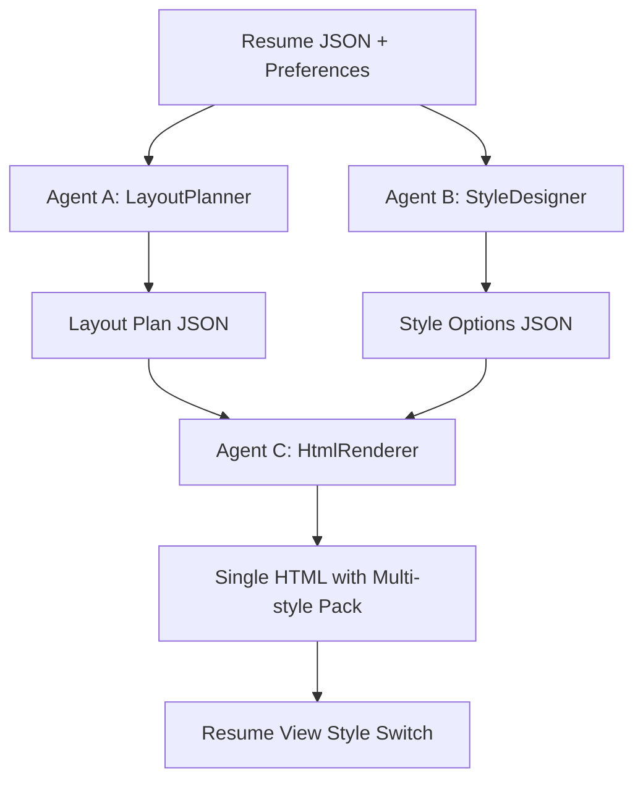

# Layout Design Main Flow

## Agent Responsibilities

- Agent A (`LayoutPlanner`): Generates structural layout constraints only (columns, section order, spacing, print constraints).
- Agent B (`StyleDesigner`): Generates multiple style variants (title treatment, color palettes, background, shadow, radius, typography).
- Agent C (`HtmlRenderer`): Accepts outputs from A+B and resume data, then renders final HTML.

## Important Constraints

- No direct rule-template HTML generation in the main path.
- HTML contains embedded style pack (`resume-style-pack`) and supports runtime style switch with `window.applyResumeStyle(styleId)`.
- For speed in `view` page, frontend can pass cached `style_options` + `layout_plan` and only switch `style_id`.

## Code Map (Graph + Nodes)

- Graph assembly: `D:\Repo\resume\src\services\layout_design\graph.py`
- Layout planner node: `D:\Repo\resume\src\services\layout_design\nodes\layout_plan_node.py`
- Style designer node: `D:\Repo\resume\src\services\layout_design\nodes\style_node.py`
- Design spec assembly node: `D:\Repo\resume\src\services\layout_design\nodes\design_spec_node.py`
- HTML renderer node: `D:\Repo\resume\src\services\layout_design\nodes\html_node.py`
- Markdown node (optional): `D:\Repo\resume\src\services\layout_design\nodes\markdown_node.py`
